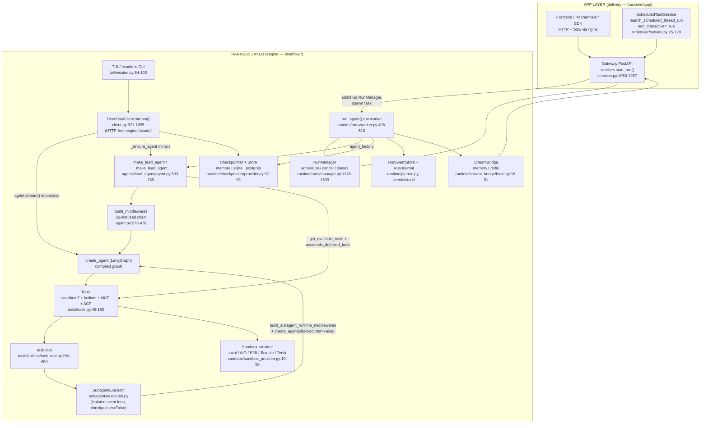

# DeerFlow Original Runtime Map

**Commit:** `095092418ccf072aa866c0a663c4056c206091e5` (branch `port/claude-code-architecture`)
**Date:** 2026-08-01
**Authority:** This document is the authoritative runtime map of DeerFlow for the Claude Code port. It synthesizes the six source-analysis notes in `docs/claude-code-port/notes/` (lead-agent-and-state, middlewares, runtime-and-persistence, subagents-and-tools, sandbox-config-models, delivery-and-tests). Every claim carries a `[path:lines]` citation inherited from those notes (paths relative to `backend/packages/harness/deerflow/` unless prefixed). For exhaustive per-component detail, read the notes; this map is the navigation layer and lifecycle contract.

---

## 1. Runtime component diagram

Four entry points converge on the same agent-assembly and runtime machinery. The harness/app boundary is CI-enforced: `deerflow.*` never imports `app.*` (`tests/test_harness_boundary.py`) [delivery-and-tests §7.1]. The gateway consumes the engine exclusively through `deerflow.runtime` + `make_lead_agent` [backend/app/gateway/services.py:38-55].



Key boundary facts:
- The "LangGraph server" is not a separate service — the harness runtime is embedded in the Gateway process; nginx rewrites `/api/langgraph/*` onto native gateway routes [backend/app/gateway/deps.py:347-490; app.py:284-332].
- The TUI proves gateway-free operation: `DeerFlowClient(checkpointer=get_checkpointer())` + `client.stream()` runs the full engine (middlewares, subagents, skills, memory, goals) with zero HTTP [tui/session.py:84-103; delivery-and-tests §2].
- Persistence is attached by the hosting runtime, not the factory: `_make_lead_agent` passes **no checkpointer** to `create_agent`; the worker sets `agent.checkpointer`/`agent.store` after build [agents/lead_agent/agent.py:677-704, 758-788; worker.py:820-830], while `DeerFlowClient` wires its constructor/global checkpointer into `create_agent` directly [client.py:130-137, 372-378].

---

## 2. Call graph (condensed)

### 2.1 `make_lead_agent` → compiled graph

```
make_lead_agent(config)                                    [agent.py:503-531]
├─ _get_runtime_config: merge configurable + context (context wins)   [agent.py:114-120]
├─ resolve AppConfig (configurable["app_config"] or get_app_config()) [agent.py:506-508]
├─ freeze_checkpoint_channel_mode + freeze_checkpoint_snapshot_frequency;
│  inject_checkpoint_mode(config, mode)                    [agent.py:509-531]
└─ _make_lead_agent(config, app_config=...)                [agent.py:534-788]
   ├─ 1. lazy imports (tools, setup/update_agent, deferred assembly) [agent.py:535-538]
   ├─ 2. mode re-read from INTERNAL_CHECKPOINT_MODE_KEY    [agent.py:542-545]
   ├─ 3. resolved_user_id = resolve_config_user_id(config) [agent.py:547-552]
   ├─ 4. runtime options (model, plan mode, subagent flags, clamps)  [agent.py:554-561]
   ├─ 5. load_agent_config + available skills allowlist    [agent.py:563-564, 481-486]
   ├─ 6. thinking/reasoning precedence request > agent > default (#4336) [agent.py:566-579]
   ├─ 7. _resolve_model_name (fallback-and-warn to models[0])        [agent.py:582-590]
   ├─ 8-9. trace metadata + root tracing callbacks (attach_tracing=False invariant) [agent.py:604-632]
   ├─ 10. skills: enabled set + build_skill_search_setup   [agent.py:634-641, 711-715]
   ├─ 11/12. bootstrap vs normal branch: tool candidates → apply_tool_authorization
   │        (Layer 1, BEFORE deferred assembly) → assemble_deferred_tools →
   │        build_mcp_routing_middleware; normal branch adds update_agent
   │        (withheld on webhook channels)                 [agent.py:643-757]
   └─ 13. create_agent(model=create_chat_model(attach_tracing=False),
          tools=final_tools,
          middleware=normalize_middleware_state_schemas(build_middlewares(...), mode),
          system_prompt=apply_prompt_template(...),
          state_schema=get_thread_state_schema(mode))      [agent.py:677-704, 758-788]
```

`build_middlewares` (public, cross-module import stability contract with `client.py`) assembles the base runtime chain via `build_lead_runtime_middlewares` then appends the 22 lead-only slots — full order in §6 [agent.py:273-478, 286-291]. `DeerFlowClient._ensure_agent` is a deliberate parallel implementation of the same assembly (no `update_agent`/`setup_agent`, no memory tools, no `reasoning_effort`/`model_overrides`), cached under a key including authorization identity [client.py:253-382; lead-agent note §8].

### 2.2 Gateway worker: `run_agent` → `graph.astream` → goal loop

```
Gateway services.start_run: validate + trust-scrub config → RunManager.create_or_reject
  (durable admission, partial unique index uq_runs_thread_active)   [services.py:1050-1267; manager.py:1376-1639]
run_agent(bridge, run_manager, record, ctx, agent_factory, ...)     [worker.py:496-510]
├─ normalize_stream_modes; build RunJournal before preflight        [worker.py:599-616, 543-547]
├─ wait_for_prior_finalizing → try_start (pending→running CAS)      [worker.py:618-632]
├─ checkpoint-mode preflight gate; pre-run workspace snapshot       [worker.py:639-681]
├─ under _checkpoint_thread_lock: _capture_rollback_point →
│  _linearize_delta_checkpoint_resume → pre_existing_message_ids    [worker.py:765-807]
├─ attach checkpointer/store; _stream_once: agent.astream loop
│  (abort checks, _publish_stream_item, subagent event buffer)      [worker.py:820-906]
├─ goal continuation loop: _prepare_goal_continuation_input →
│  hidden turn via _continuation_runnable_config (selector dropped) [worker.py:908-932, 744-751]
├─ terminal staging: aborted | llm-error-fallback | success/delivery-incomplete
│  (stop_reason read from runtime context)                          [worker.py:934-986]
└─ finally: flush subagent events → workspace_changes → journal.flush →
   run.delivery receipt (put_if_absent) → persist staged status →
   completion data → interrupted-title fallback → title sync +
   run_durations checkpoint → on_run_completed → publish_end        [worker.py:1044-1180]
```

### 2.3 `task` tool → `SubagentExecutor._aexecute`

```
task_tool(runtime, description, prompt, subagent_type, tool_call_id)  [task_tool.py:230-237]
├─ get_subagent_config (builtins → custom_agents → overrides → global defaults) [registry.py:22-116]
├─ extract parent context (sandbox, thread_data, thread_id, model, identity)    [task_tool.py:316-363]
├─ _merge_skill_allowlists (child ∩ parent)                        [task_tool.py:187-195]
├─ child tools: get_available_tools(subagent_enabled=False, include_upload_tool=False) [task_tool.py:372-395]
├─ SubagentExecutor(...).execute_async(prompt, task_id=tool_call_id)            [task_tool.py:397-422]
│  └─ scheduler pool → persistent isolated event loop → _aexecute:
│     _build_initial_state (skills, authz Layer 1, deferred assembly,
│     one combined SystemMessage) → _create_agent(checkpointer=False,
│     system_prompt=None, recursion_limit=max_turns) → astream("values")
│     with step capture + cooperative cancel                       [executor.py:610-1008, 1100-1161]
└─ 5s polling loop in-tool → task_started/running/completed/failed/
   cancelled/timed_out custom events → format_subagent_result_message →
   Command(update={messages:[ToolMessage + subagent additional_kwargs]}) [task_tool.py:424-627; status_contract.py:196-246]
```

---

## 3. State lifecycle

### 3.1 `ThreadState` channels + reducers

`ThreadState(AgentState)` — `messages` inherited; the rest [agents/thread_state.py:264-277]:

| Channel | Reducer | Merge policy |
|---|---|---|
| `sandbox` | `merge_sandbox` | idempotent-only: identical ids merge, conflicting non-None ids **raise** (fail-closed lifecycle bug detection) [thread_state.py:59-80] |
| `thread_data` | LastValue | `{workspace_path, uploads_path, outputs_path}` [thread_state.py:39-42] |
| `title` | LastValue | written by TitleMiddleware [thread_state.py:267] |
| `artifacts` | `merge_artifacts` | merge + order-preserving dedupe [thread_state.py:83-90] |
| `todos` | `merge_todos` | last-non-None wins; explicit `[]` replaces [thread_state.py:110-120] |
| `goal` | `merge_goal` | None preserves; any non-None replaces [thread_state.py:123-127] |
| `uploaded_files` | LastValue | UploadsMiddleware listing [thread_state.py:271] |
| `viewed_images` | `merge_viewed_images` | per-key new-wins metadata only (no base64, #4138); empty `{}` clears all [thread_state.py:45-57, 93-107] |
| `promoted` | `merge_promoted` | catalog-hash-scoped: changed hash replaces wholesale, same hash unions names [thread_state.py:130-153] |
| `delegations` | `merge_delegations` | same-id latest wins, terminal status never downgraded, first-seen order + original `created_at`/`run_id` kept, capped at 50 entries; `stop_reason` additive [thread_state.py:156-204] |
| `skill_context` | `merge_skill_context` | reference-not-body entries, dedupe by path, recency cap 8, description cap 500 chars [thread_state.py:207-261] |
| `summary_text` | LastValue | compaction summary, projected via DurableContext instead of living in `messages` [thread_state.py:276] |

`THREAD_STATE_REDUCER_FIELDS = {messages, sandbox, artifacts, todos, goal, viewed_images, promoted, delegations, skill_context}` [thread_state.py:381-393].

### 3.2 Full vs delta mode

- `get_thread_state_schema(mode)`: `"full"` → `ThreadState`; `"delta"` → `messages` becomes `Annotated[list, DeltaChannel(merge_message_writes, snapshot_frequency)]` (frequency: explicit → process-frozen → default) [thread_state.py:366-414]. `merge_message_writes` reproduces full public `add_messages` semantics (id allocation, in-place replacement, `RemoveMessage`, `REMOVE_ALL_MESSAGES`) in linear time [thread_state.py:279-363].
- Mode is **process-frozen** (`freeze_checkpoint_channel_mode` raises `CheckpointModeReconfigurationError` on a second different value); snapshot frequency frozen alongside [runtime/checkpoint_mode.py:39-78]. Marker: `configurable.__deerflow_checkpoint_channel_mode` always; `metadata.deerflow_checkpoint_channel_mode="delta"` in delta mode; absence = full (no migration needed) [checkpoint_mode.py:18-19, 81-88].
- Asymmetric fail-closed gate: full-mode process touching a delta thread raises `CheckpointModeMismatchError`; delta reads full transparently. Writes pre-checked on the head, reads post-checked on the snapshot [checkpoint_mode.py:114-143].
- `normalize_middleware_state_schemas` swaps every middleware `state_schema`'s `messages` annotation to the delta field in delta mode [thread_state.py:417-447]. Importing `thread_state` applies `checkpoint_patches` (InMemory delta-history fix; BinaryOperatorAggregate Overwrite-seed fix, #4380) [thread_state.py:18; checkpoint_patches.py:27-188].

### 3.3 Checkpoint write points

Per-superstep checkpoints are written by the graph itself; all **out-of-band** writes go through one of two disciplines:

1. **State mutation graph** — `build_state_mutation_graph(as_node, mode, state_schema)` compiles a one-node graph so `update_state(as_node=...)` applies reducer writes with no pending agent nodes (head stays idle); reducer/Delta channels require `Overwrite` wrapping for replace-style writes [runtime/checkpoint_state.py:32-108]. Used by manual compaction (`as_node="manual_compaction"`) [runtime/context_compaction.py:151-169] and delta-resume linearization (`checkpoint_resume`) [worker.py:1632-1718].
2. **Raw `aput` with parentage + version bumps** — goal writes [runtime/goal.py:524-535], run-duration metadata checkpoints [worker.py:1963-1979], interrupted-title checkpoints [worker.py:2065-2078]. All parent to the tuple they derived from and bump `channel_versions` for exactly the channels written; a parentless write severs delta ancestry / truncates history [runtime-and-persistence §2].

Staleness is handled by optimistic CAS on the head `checkpoint_id` (`GoalWriteConflict`, 3-retry loops for duration/title) — never a store transaction [goal.py:496-500; worker.py:1936-1981, 2027-2035]. All checkpoint mutations during a run are serialized under the per-thread `_checkpoint_thread_lock` [worker.py:90-109].

`CheckpointStateAccessor` is the single choke point for materialized thread-state access (re-prepares config, injects mode marker, applies the gate; delta raw reads see sentinels so materialized reads must go through the bound graph) [runtime/checkpoint_state.py:1-15, 111-196].

---

## 4. Tool-call lifecycle

```mermaid
sequenceDiagram
    participant M as Model
    participant AM as after_model guards<br/>(reverse dispatch)
    participant RBW as ReadBeforeWrite (outer)
    participant TP as ToolProgress
    participant TEH as ToolErrorHandling (inner)
    participant T as Tool handler

    M->>AM: AIMessage with tool_calls
    Note over AM: reverse-order after_model:<br/>Safety → TokenBudget → LoopDetection → SubagentLimit …
    AM->>AM: SubagentLimit: drop excess task calls,<br/>stamp subagent_limit_capped [subagent_limit_middleware.py:135-165]
    AM->>AM: LoopDetection: hash windows;<br/>warn (queued) or hard stop → strip tool_calls,<br/>stop_reason=loop_capped [loop_detection_middleware.py:408-609]
    AM->>RBW: surviving tool_calls dispatched
    Note over RBW,TEH: wrap_tool_call stack (first = outermost):<br/>…ReadBeforeWrite → ToolProgress → ToolErrorHandling…<br/>build guard raises if Progress lands inner of ErrorHandling<br/>[tool_error_handling_middleware.py:287-291]
    RBW->>RBW: write_file/str_replace: compare live hash<br/>vs latest deerflow_read_mark; block on mismatch<br/>[read_before_write_middleware.py:97-160]
    RBW->>TP: allowed
    TP->>TP: blocked tool? intercept with [TOOL_BLOCKED]<br/>ToolMessage; else pass [tool_progress_middleware.py:284-299]
    TP->>TEH: pass
    TEH->>T: execute (sandbox / builtin / MCP)
    T-->>TEH: result or exception
    TEH->>TEH: exception → error ToolMessage (500-char detail) +<br/>stamp_exception_meta; task exceptions get<br/>subagent status contract [tool_error_handling_middleware.py:42-88]
    TEH->>TEH: normalize_tool_result → deerflow_tool_meta<br/>{status, error_type, recoverable_by_model,<br/>recommended_next_action, source} [tool_result_meta.py:34-136]
    TEH-->>TP: ToolMessage (meta stamped)
    TP->>TP: update phase state machine from meta +<br/>Jaccard near-duplicate check; queue [PROGRESS HINT]<br/>[tool_progress_middleware.py:378-411]
    TP-->>RBW: result
    RBW->>RBW: successful read_file → stamp deerflow_read_mark<br/>{path, sha256} [read_before_write_middleware.py:240-258]
    RBW-->>M: ToolMessage appended to state;<br/>queued hints/warnings injected as trailing<br/>HumanMessage at the NEXT model call
```

Notes:
- The outer wrap layers not shown (before ReadBeforeWrite) also run per call: ToolOutputBudget (externalize >12k chars to `/mnt/user-data/outputs/.tool-results/` or head+tail truncate) [tool_output_budget_middleware.py:589-651], ToolResultSanitization (neutralize tags in `web_*` results) [tool_result_sanitization_middleware.py:136-156], Sandbox (persist lazily acquired sandbox id via `Command`) [sandbox/middleware.py:201-229], Guardrail instances (authz adapter, then provider — denied calls short-circuit with an error ToolMessage) [guardrails/middleware.py:125-217], SandboxAudit (`bash` only: block/warn/pass verdicts) [sandbox_audit_middleware.py:246-269].
- `deerflow_tool_meta` taxonomy — status `success|error|partial_success`; error keyword rules, first match wins: `auth`(stop) / `rate_limited`(summarize) / `transient`(try_alternative) / `config`(stop) / `permission`(try_alternative) / `no_results`(rewrite_query) / `not_found`(rewrite_query) / `internal`(stop), fallback `unknown`(try_alternative); plus web_fetch error-shell detection and partial-success markers [tool_result_meta.py:43-136, 246-304].
- Middleware-intercepted tools never reach their handler: `ask_clarification` (ClarificationMiddleware → `Command(goto=END)`) [clarification_tool.py:89-92], deferred unpromoted MCP tools (DeferredToolFilter error ToolMessage) [deferred_tool_filter_middleware.py:62-74], skill-policy-denied tools [skill_tool_policy_middleware.py:223-237].

---

## 5. Subagent lifecycle

```mermaid
sequenceDiagram
    participant L as Lead graph
    participant TT as task_tool
    participant SP as scheduler pool (3 workers)
    participant IL as persistent isolated loop
    participant SG as Subagent graph
    participant ST as ThreadState (parent)

    L->>TT: task(description, prompt, subagent_type)
    Note over L: SubagentLimitMiddleware already enforced<br/>min(concurrent 1-4, total 6/run) [subagent_limit_middleware.py:135-140]
    TT->>TT: get_subagent_config; bash requires<br/>is_host_bash_allowed [task_tool.py:287-306]
    TT->>SP: execute_async(prompt, task_id=tool_call_id)<br/>register PENDING SubagentResult [executor.py:1100-1161]
    SP->>IL: submit _aexecute in copied context<br/>(loop-bound callbacks stripped) [executor.py:365-400]
    IL->>SG: _build_initial_state (skills ∩ parent allowlist,<br/>authz Layer 1, deferred assembly, ONE SystemMessage) →<br/>create_agent(checkpointer=False, system_prompt=None,<br/>recursion_limit=max_turns) [executor.py:610-767, 581-590]
    TT->>L: emit task_started {task_id, description, model_name}<br/>[task_tool.py:433-443]
    loop astream(stream_mode="values")
        SG->>IL: values snapshot
        IL->>IL: capture_new_step_messages (AI + Tool msgs, #3779);<br/>publish cumulative token snapshot [executor.py:909-921]
        TT->>L: task_running {message, index, usage} per new step<br/>(5s in-tool polling; the LLM never polls) [task_tool.py:473-493, 424-431]
    end
    alt normal completion
        IL->>IL: _extract_llm_error_fallback (last msg only) → FAILED,<br/>else _extract_final_result; stop_reason =<br/>consume_stop_reason from guards (token_capped/loop_capped)<br/>[executor.py:925-948, 592-608]
    else GraphRecursionError (turn cap)
        IL->>IL: stop_reason = guard reason or "turn_capped";<br/>usable partial → COMPLETED+capped, else FAILED [executor.py:950-1008]
    else timeout / cancel
        IL->>IL: FuturesTimeoutError → TIMED_OUT + cancel_event;<br/>cooperative cancel at iteration boundaries [executor.py:895-907, 1140-1161]
    end
    IL-->>TT: try_set_terminal (exactly-once) [executor.py:136-158]
    TT->>L: terminal event task_completed/failed/cancelled/timed_out<br/>+ usage; report usage to parent RunJournal once [task_tool.py:496-591, 114-175]
    TT->>ST: Command(update={messages:[ToolMessage<br/>"Task Succeeded (capped: …). Result: …",<br/>additional_kwargs={subagent_status, subagent_stop_reason,<br/>result_brief(2000), result_sha256, model, usage}]})<br/>[status_contract.py:130-246; task_tool.py:198-227]
    ST->>ST: DurableContextMiddleware captures ledger entry<br/>(terminal never downgraded, run_id-tagged) [durable_context_middleware.py:225-247]
    ST->>ST: TokenUsageMiddleware merges subagent usage into<br/>dispatching AIMessage via pop_cached_subagent_usage<br/>[token_usage_middleware.py:275-314]
```

Contract anchors: status enum `completed/failed/cancelled/timed_out/polling_timed_out`, stop_reason enum `token_capped/turn_capped/loop_capped`, pinned cross-language in `contracts/subagent_status_contract.json` v2 [status_contract.py:34-41; contracts/subagent_status_contract.json:1-6]. Built-ins: `general-purpose` (inherit all tools minus `task/ask_clarification/present_files`, max_turns 150, timeout 1800s) and `bash` (5 sandbox tools, max_turns 60, hidden when host bash disallowed) [subagents/builtins/general_purpose.py:66-70; bash_agent.py:46-49; registry.py:150-165]. Subagent worker `task_*` custom events are batch-persisted as `subagent.start/step/end` run events by the worker's `_SubagentEventBuffer` [worker.py:434-493].

---

## 6. Middleware sequence

Framework semantics: first in list = outermost `wrap_model_call`/`wrap_tool_call`; `before_*` in list order; `after_model`/`after_agent` in **reverse** order [middlewares note preamble]. Full per-middleware detail: `notes/middlewares.md` §2.

### 6.1 Lead chain (36 slots; *(c)* = conditional)

Base 1-14 from `_build_runtime_middlewares` [tool_error_handling_middleware.py:155-293]; 15-36 appended by `build_middlewares` [agent.py:273-478]:

| # | Middleware | One-liner / condition |
|---|---|---|
| 1 | InputSanitization | escape 42 blocked tags, wrap user text in BEGIN/END USER INPUT markers; fail-open |
| 2 | ToolOutputBudget | externalize >12k-char tool results to disk + synopsis, else head/tail truncate *(no-op if `tool_output.enabled=False`)* |
| 3 | ToolResultSanitization | neutralize untrusted tags in `web_fetch/web_search/image_search/web_capture` results |
| 4 | ThreadData | compute workspace/uploads/outputs paths; stamp run_id/timestamp on last HumanMessage |
| 5 | Uploads *(lead only)* | inject `<current_uploads>` block; preserve original user content key |
| 6 | Sandbox | lazy sandbox acquire/persist id via Command; release in after_agent (not for fork-restored state) |
| 7 | DanglingToolCall | request-only repair: synthetic ids, placeholder error ToolMessages, orphan drop |
| 8 | LLMErrorHandling | classify/retry/backoff/circuit-break provider errors; error-fallback AIMessage instead of raise |
| 9 | Guardrail (authz adapter) *(c: authorization.enabled)* | run-time tool deny from RBAC policy |
| 10 | Guardrail (provider) *(c: guardrails.enabled)* | external policy tool gate, fail_closed default |
| 11 | SandboxAudit | `bash` risk classifier: block/warn/pass + JSON audit log |
| 12 | ReadBeforeWrite *(c: enabled, default True)* | hash-gate `write_file/str_replace` against latest `read_file` mark |
| 13 | ToolProgress *(c: enabled, default False)* | stagnation state machine (3+2, Jaccard 0.8) → hints → block |
| 14 | ToolErrorHandling | exceptions → error ToolMessages; `deerflow_tool_meta` normalization; skill-read stamping. Build guard: must be inner of ToolProgress [lines 287-291] |
| 15 | DynamicContext | per-turn date/memory `<system-reminder>` via ID-swap triplet (static prompt / prefix-cache) |
| 16 | SkillActivation | `/skill` slash activation + request-scoped secret binding (owner token shared with #17) |
| 17 | SkillToolPolicy | `allowed-tools` enforcement per active skill |
| 18 | DurableContext | capture delegations/skill refs; project summary+ledger+skills as hidden data block |
| 19 | DeerFlowSummarization *(c: summarization.enabled + anchor model)* | compaction (see §9) |
| 20 | Todo *(c: is_plan_mode)* | `write_todos` + context-loss reminder + premature-exit jump_to=model (max 2) |
| 21 | TokenUsage *(c: token_usage.enabled, default True)* | merge subagent usage; attribution stamps |
| 22 | Title | one-time thread title (LLM if `title.model_name`, else local fallback) |
| 23 | Memory *(c: see note)* | after_agent handoff to debounced background memory extraction |
| 24 | ViewImage *(c: model supports_vision)* | inject/remove one-step base64 image context messages |
| 25 | McpRouting *(c: instance passed)* | keyword auto-promote top-k deferred tools; must precede #26 |
| 26 | DeferredToolFilter *(c: deferred names)* | hide unpromoted MCP schemas; block unpromoted calls (+ ordering assert) |
| 27 | SystemMessageCoalescing | merge all SystemMessages into one leading message (strict providers) |
| 28 | SubagentLimit *(c: subagent_enabled)* | truncate excess `task` calls; concurrency 1-4 / total 6 per run |
| 29 | LoopDetection *(c: enabled, default True)* | identical-call-set hashes (warn 3 / hard 5) + per-tool freq (30/50) → `loop_capped` |
| 30 | TokenBudget *(c: enabled, default False)* | per-run token accounting; warn 0.8 / hard-stop 1.0 → `token_capped` |
| 31 | custom_middlewares *(c: caller)* | embedded-client extras |
| 32 | configured extensions *(c: extensions.middlewares)* | reflection-loaded classes, fail-loud at build |
| 33 | TerminalResponse | one retry for empty terminal AIMessage, then visible error fallback |
| 34 | ModelLengthFinishReason | stamp `model_length_capped` for length-capped completions (never rewrites) |
| 35 | SafetyFinishReason *(c: enabled, default True)* | strip tool_calls / backfill text on safety termination → `safety_capped`; registered late so reverse after_model runs it FIRST |
| 36 | Clarification | intercept `ask_clarification` → structured card + `Command(goto=END)`; always last |

Ordering rationale comment block: agent.py:263-272. The exact order is test-pinned by `test_build_lead_runtime_middlewares_chain_order_matches_agents_md` [delivery-and-tests §6].

### 6.2 Subagent chain

Base 1-14 **minus Uploads** (`include_uploads=False`), then [tool_error_handling_middleware.py:314-531]: SkillActivation → SkillToolPolicy → [ViewImage] → [McpRouting] → [DeferredToolFilter] → [LoopDetection] → [TokenBudget — **default-enabled**, 1M tokens when summarization on else 2M, warn 0.7] → [extensions] → [SafetyFinishReason] → DurableContext → [Summarization with `skip_memory_flush=True`] → SystemMessageCoalescing (last). Absent vs lead: Uploads, DynamicContext, Todo, TokenUsage, Title, Memory, SubagentLimit, TerminalResponse, ModelLengthFinishReason, Clarification [middlewares note §1.3].

---

## 7. Checkpoint & resume lifecycle

1. **Rollback point capture** — before streaming, under `_checkpoint_thread_lock`, `_capture_rollback_point()` materializes pre-run state and raw `pending_writes` into an immutable `RollbackPoint`; capture failure disables rollback entirely (fail-closed); `pre_existing_message_ids` collected to mask stale error-fallback markers and mark the current-run boundary [worker.py:765-786, 1551-1599].
2. **Interrupt/rollback admission** — `multitask_strategy ∈ {reject, interrupt, rollback}`: replacement admission claims+interrupts inflight predecessors in the same transaction as the replacement insert; local records get `abort_action = strategy`; the replacement waits in `wait_for_prior_finalizing` before entering the graph. Non-run thread operations (`checkpoint_write`/`artifact_write` reservations, e.g. manual compaction) block admission with `ConflictError` [manager.py:1446-1639; worker.py:618-622].
3. **Cancel** — `RunManager.cancel(run_id, action)`: local abort_event (worker breaks at the next stream chunk) or durable cancel handoff via lease rows; `interrupt` keeps the checkpoint (status `interrupted`), `rollback` restores the pre-run capture (status `error`, "Rolled back by user") [manager.py:1187-1359; worker.py:554-596, 859-861].
4. **Rollback restore** — full mode forks from the captured pre-run checkpoint writing `Overwrite(captured_messages)`; delta mode replaces **every** captured channel on the current head (head-only channels reset to schema defaults, reducer channels Overwrite-wrapped) because delta cannot fork once sibling writes attached; captured raw `pending_writes` re-attached per task_id afterwards [worker.py:1721-1825].
5. **Delta resume linearization** — resuming from a non-head `checkpoint_id` in delta mode would replay abandoned sibling writes (#4458); `_linearize_delta_checkpoint_resume` materializes the selected checkpoint's state, writes a complete replacement onto the current head via a `checkpoint_resume` mutation graph, and pops the selector; failures propagate (a corrupt fork is worse than a failed resume). Full mode forks natively [worker.py:1632-1718].
6. **Clarification interrupt → resume** — ClarificationMiddleware builds a ToolMessage with deterministic id (`clarification:{tool_call_id}`) whose `artifact.human_input` carries the structured card, and returns `Command(goto=END)`: the run ends cleanly and waits; `__interrupt__` is preserved in serialized values frames for SDK detection. The reply arrives as a **new run** whose input is a `hide_from_ui` HumanMessage with `additional_kwargs.human_input_response` (strict v1 text/option envelope validated by `read_human_input_response`); the journal persists it only for allowlisted sources [clarification_middleware.py:401-448; runtime/serialization.py:59-71; agents/human_input.py:33-77; journal.py:53-64].
7. **Goal continuation as resume** — hidden `<goal_continuation>` turns always drop checkpoint selectors and continue from the head; continuation requires a durable end-of-turn receipt (head has an id, empty `pending_writes`, visible trailing AI message) and passes CAS checks (`thread_changed_*` stand-downs) [worker.py:744-751, 1229-1246, 1403-1514].
8. **Crash/orphan recovery** — heartbeat leases fail closed (`ownership_lost` fence: no further durable writes); reconciliation atomically claims expired/NULL-lease active rows, marks them `error` with `stop_reason="orphan_recovered"`, and backfills a zero delivery receipt via the same `put_if_absent` singleton (an existing receipt is preserved) [manager.py:1700-2069, 987-1006].

---

## 8. Error & retry lifecycle

**LLM error normalization** (LLMErrorHandlingMiddleware): classify → non-retriable (quota/auth/generic) | retriable (`burst_rate`, transient exception classes, HTTP 408/409/425/429/5xx, busy). Retry budget default 3 (per-exception/per-reason overrides, tightest wins); backoff honors `Retry-After` verbatim else decorrelated jitter (base 1s / burst 5s, cap 8s); circuit breaker (threshold 5, recovery 60s, half-open probe); process-wide concurrency cap optional. On exhaustion: an **error-fallback AIMessage** stamped `deerflow_error_fallback: True` ends the graph cleanly instead of raising [llm_error_handling_middleware.py:369-891]. The worker maps a root-frame fallback (or `journal.had_llm_error_fallback`) to run status `error` ("LLM provider failed after retries") [worker.py:934-986]; the subagent executor maps the same marker to `FAILED` [executor.py:204-252, 925-931].

**Tool error taxonomy** — `deerflow_tool_meta.error_type`, 8 named classes + fallback: `auth`, `rate_limited`, `transient`, `config`, `permission`, `no_results`, `not_found`, `internal` (fallback `unknown`), each with `recoverable_by_model` + `recommended_next_action ∈ {continue, rewrite_query, try_alternative, summarize, stop}` [tool_result_meta.py:43-82]. Exceptions become error ToolMessages (never raised to the model); ToolProgress consumes the meta for its stagnation/block escalation [tool_error_handling_middleware.py:69-88; tool_progress_middleware.py:378-411].

**TerminalResponse retry** — empty terminal AIMessage after tool activity: remove it, `jump_to: "model"` with a hidden recovery prompt, once per run; second failure persists a visible fallback stamped `deerflow_error_fallback` so the run worker finishes as error [terminal_response_middleware.py:74-214].

**Loop hard-stop** — LoopDetection at hard limit does not raise: it replaces the last AIMessage with tool_calls stripped, `[FORCED STOP]` text appended, and records `loop_capped` in both `runtime.context["stop_reason"]` and its per-run `consume_stop_reason` map [loop_detection_middleware.py:544-609].

**Token budget stop** — same pattern: strip tool_calls, append `[TOKEN BUDGET EXCEEDED]`, record `token_capped`; warn once at 0.8 via injected `budget_warning` HumanMessage [token_budget_middleware.py:228-300].

**stop_reason channel** — guard middlewares communicate caps via `runtime.context["stop_reason"]` (`loop_capped`, `token_capped`, `safety_capped`, `subagent_limit_capped`, `model_length_capped`) plus per-instance `consume_stop_reason(run_id)` (LoopDetection, TokenBudget); the worker persists it on the run record, the subagent executor folds it into the status contract [middlewares note §3; worker.py:951-967; executor.py:592-608].

**Subagent failure mapping** — terminal statuses: provider fallback → FAILED; `GraphRecursionError` → `turn_capped` with usable-partial recovery (COMPLETED+capped when a non-empty AIMessage exists, #4042 ordering: fallback check first); executor timeout → TIMED_OUT; cancel_event → CANCELLED; polling cap in the task tool → `polling_timed_out`. All folded into model-visible text (`"Task failed (capped: token budget). Error: …"`) plus structured `additional_kwargs` [executor.py:950-1016; status_contract.py:196-246].

**Orphan recovery (behavioral)** — a run whose worker dies is terminalized by a peer/startup reconciler: status `error`, `stop_reason="orphan_recovered"`, delivery receipt backfilled idempotently; `update_run_completion` refuses to replace a different terminal status; a fenced worker performs no durable writes [manager.py:1845-2069; runtime/runs/store/base.py:183-189].

---

## 9. Context & summarization lifecycle

- **Trigger accounting** — `_prepare_compaction` counts tokens over `messages` **plus** a synthetic summary-carrier message (existing `summary_text` weighs into the trigger), then defers to the parent `SummarizationMiddleware`'s `_should_summarize`/cutoff. Config: `trigger` (fraction/tokens/messages, default None), `keep` default 20 messages, `trim_tokens_to_summarize` 4000; `summarization.enabled` default False gates lead AND subagent compaction [summarization_middleware.py:333-340, 458-481; config/summarization_config.py:25-53].
- **Keep policy / reminder rescue** — after partitioning, dynamic-context reminders and their ID-swap peers (`{base}__user`, `{base}__memory`) are rescued from the summarize window in chronological order [summarization_middleware.py:571-623].
- **`summary_text` projection** — success returns `{messages: [RemoveMessage(REMOVE_ALL_MESSAGES), *preserved], summary_text: <summary>}`; the summary lives in a LastValue channel, not a message, and DurableContextMiddleware projects it into subsequent requests inside a `<durable_context_data>` hidden HumanMessage (summary budget 6000 chars, delegation ledger budget 6000, active-skills lines) behind an authority-contract SystemMessage [summarization_middleware.py:547-569; durable_context_middleware.py:249-271].
- **Model candidates** — configured `summarization.model_name` then the run's own model, deduped; summary model tagged `middleware:summarize` + `TAG_NOSTREAM`; blank summaries count as failures; automatic-path failure leaves state untouched (retried later) [summarization_middleware.py:164-245, 496-507].
- **Memory flush hook** — lead compaction fires `before_summarization` hooks (memory flush when `memory.enabled`) only after a summary exists; the subagent factory passes `skip_memory_flush=True` so subagent turns never pollute the parent thread's memory [summarization_middleware.py:508-518, 625-647; middlewares note 14k].
- **Manual compaction** (`POST /threads/{id}/compact` → `compact_thread_context`) — resolves the model mirroring lead resolution, calls `acompact_state(force=True, raise_on_failure=True)` (`SummaryGenerationError` → HTTP 500-distinct `ContextCompactionFailed`), writes through the accessor as `as_node="manual_compaction"` with `Overwrite(preserved)` + `summary_text`; serialized against runs by `reserve_checkpoint_write()` [runtime/context_compaction.py:41-169; manager.py:1641-1698].
- **Per-turn dynamic context** — DynamicContextMiddleware keeps the system prompt byte-identical (prefix caching) by injecting date/memory as an ID-swap triplet into the first HumanMessage; midnight crossings inject a date-only update; SystemMessageCoalescing keeps only the latest date reminder [dynamic_context_middleware.py:189-307; system_message_coalescing_middleware.py:78-116].

---

## 10. Filesystem & artifact lifecycle

- **Virtual mapping** — `/mnt/user-data/{workspace,uploads,outputs}` → `{base_dir}/users/{user_id}/threads/{thread_id}/user-data/{…}`; `/mnt/acp-workspace` per-thread; `/mnt/skills/public` global enabled-only projection, `/mnt/skills/{custom,legacy,integrations}` per-user projections. `base_dir` = `$DEER_FLOW_HOME` or `{project_root}/.deer-flow` [config/paths.py:102-161, 259-346; local_sandbox_provider.py:279-359]. Path security: `validate_local_tool_path` (`/mnt/user-data` read+write, skills/ACP read-only, `..` always rejected); resolved paths re-validated with `relative_to`; host paths masked back to virtual in all tool output [sandbox/tools.py:848-947, 744-845].
- **Uploads** — gateway stages to `.upload-*.part` (hidden, swept at startup); normalized/deduped filenames (`_N` suffixes); symlink/hardlink-refusing `O_NOFOLLOW` writes (TOCTOU defense against a sandboxed process planting symlinks) [uploads/manager.py:29-259]. UploadsMiddleware injects `<current_uploads>` (≤10 files listed, outlines/previews, tag-neutralized) into the last human message and writes `state["uploaded_files"]` [uploads_middleware.py:201-308].
- **Workspace-changes snapshots** — pre-run `capture_workspace_snapshot` over `workspace` + `outputs` roots (uploads excluded); post-run `record_workspace_changes` does a metadata scan → changed-path text re-read → unified diffs → one `workspace_changes` event. Limits: 200 reported / 2000 scanned files, 256 KiB per-file diff, 1 MiB aggregate; sensitive-pattern paths (`.env`, `*secret*`, `*.pem`, …) are metadata-only stubs; symlinks never followed [workspace_changes/recorder.py:26-167; scanner.py:19-330; types.py:18-27].
- **present_files delivery receipts** — only paths resolving under the thread's `outputs_path` may be presented; success returns `Command(update={artifacts: paths, messages:[…]})` deduped by `merge_artifacts` [present_file_tool.py:33-121]. At run end the worker computes `produced_output_paths` from the workspace diff; a successful run with produced outputs not covered by a presented path is downgraded to `error` ("Artifact delivery incomplete…"); the idempotent `run.delivery` receipt (`put_if_absent`) is persisted **before** the staged terminal status, closing the crash window [worker.py:951-967, 1061-1113; workspace_changes/diff.py:17-221].
- **Tool-output externalization** — oversized tool results land at `/mnt/user-data/outputs/.tool-results/{tool}-{hex}.{ext}` with a typed synopsis, so large payloads live on disk, not in checkpoints [tool_output_budget_middleware.py:129-219].

---

## 11. Configuration lifecycle

- **Resolution order** — `config.yaml`: explicit path → `$DEER_FLOW_CONFIG_PATH` → project root → legacy roots; `get_app_config()` caches and auto-reloads on path or `(mtime, size, sha256)` signature change; `AppConfig` is `extra="allow"`, null sections fall back to defaults, singleton sub-configs re-published per load [config/app_config.py:341-369, 429-464, 522-545, 606-671]. `extensions_config.json` (MCP servers + skills enablement + extension middlewares): explicit path → `$DEER_FLOW_EXTENSIONS_CONFIG_PATH` → project root → legacy → optional-None; `$VAR` resolves with missing vars → `""` (config.yaml raises instead); writes are atomic (same-dir tmp + fsync + `os.replace`) under a write lock [config/extensions_config.py:28-428].
- **Hot-reload boundary** — restart-required fields registered in `reload_boundary.STARTUP_ONLY_FIELDS`: `database`, `checkpointer`, `run_events`, `agent_storage`, `stream_bridge`, `sandbox`, `log_level`, `logging` (+ non-schema `channels`) [config/reload_boundary.py:36-60]. Additionally process-frozen at first use (not merely startup-only): checkpoint channel mode + snapshot frequency [runtime/checkpoint_mode.py:39-78], the LLM concurrency cap [llm_error_handling_middleware.py:321-366]. MCP tool cache invalidates on extensions-config path/signature change, fail-soft to last-known-good when the file disappears mid-run [mcp/cache.py:18-113].
- **Feature gates (defaults)** — enabled by default: `tool_output`, `read_before_write`, `loop_detection`, `token_usage`, `title`, `safety_finish_reason`, `memory`, `skill_scan`, subagent token budget. Disabled by default: `summarization`, `tool_progress`, lead `token_budget`, `tool_search` (deferred MCP), `skills.deferred_discovery`, `guardrails`, `authorization`, `scheduler`, `skill_evolution`, `subagent_enabled` (runtime flag), `is_plan_mode` (runtime flag), `allow_host_bash` [sandbox-config-models §7; middlewares note §1].
- **Config injection points** — per-run overrides ride `configurable`/`context` (context wins on merge) [agent.py:114-120]; server-owned keys are trust-scrubbed at the gateway boundary (`is_internal`, `authz_attributes`, `channel_user_id`, `langgraph_auth_user*`, `__`-prefixed keys; secrets redacted before run kwargs persist) [services.py:1050-1267; runtime/secret_context.py:21-52]; the scheduler is the only internally-authenticated source of `non_interactive=True` [deer-flow/AGENTS.md scheduled-task note].
- **Custom agents** — stored per-user as `config.yaml` + `SOUL.md` (file or DB backend), mutated only via `setup_agent` (bootstrap) / `update_agent` (withheld on webhook channels; preserves non-managed fields; "takes effect on the next user turn") [config/agents_config.py:46-238; update_agent_tool.py:46-268].

---

*End of runtime map. Exhaustive detail per area: `notes/lead-agent-and-state.md`, `notes/middlewares.md`, `notes/runtime-and-persistence.md`, `notes/subagents-and-tools.md`, `notes/sandbox-config-models.md`, `notes/delivery-and-tests.md`.*
